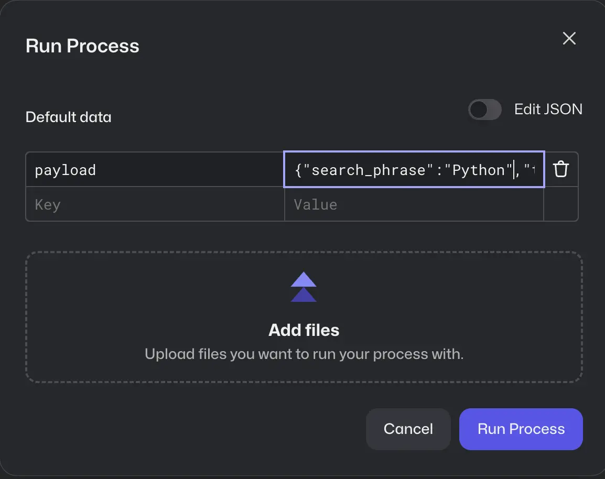
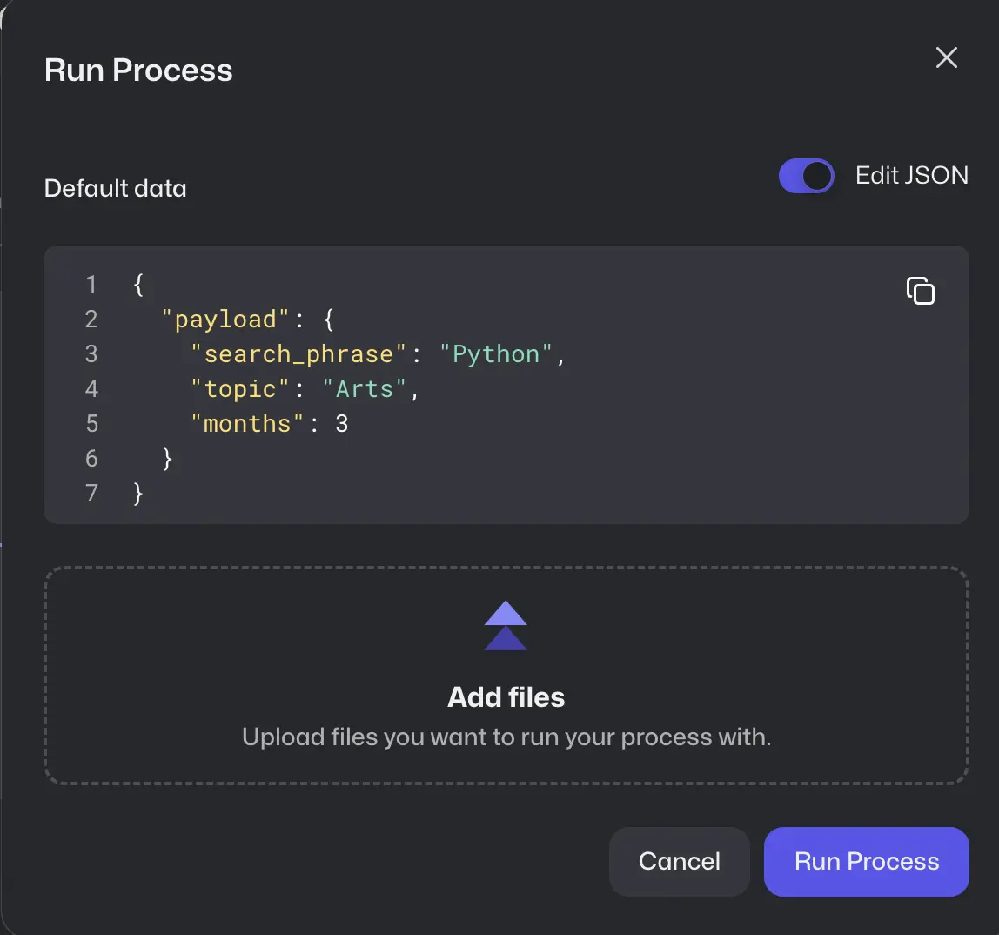
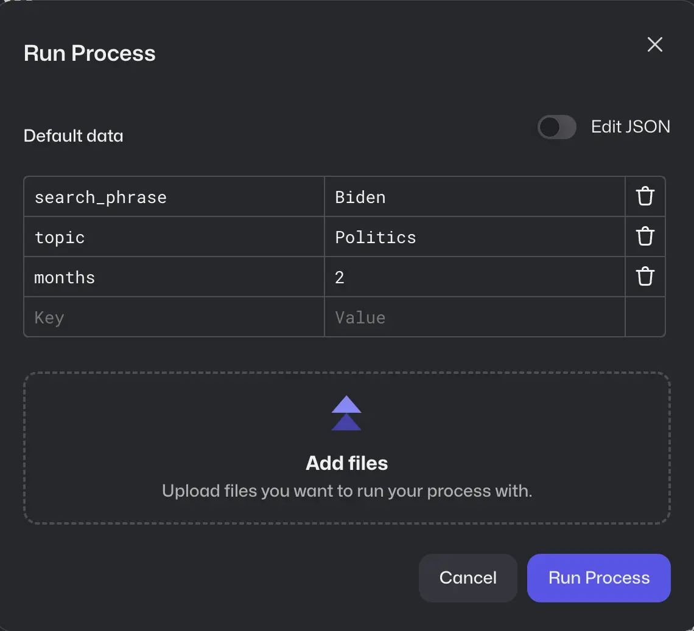

# RPA Challenge 2.0 - Fresh News

The challenge is to automate the process of extracting data from the news website
[Angeles Time](https://www.latimes.com/). The final output will be a directory in ./output/ containing Excel files with the extracted data and the corresponding news images.

### Recommended VS Code Plugins

For an enhanced development experience, we recommend installing the plugins listed under the `.vscode` folder. These plugins are designed to maintain a consistent coding environment and boost productivity.

## Prerequisites

Ensure you have the following packages installed in your environment:
- Packages defined in `conda.yaml`

## Installation

This setup and codebase were originally configured for deployment in `Robocloud`, leveraging its workitem functionality.
To execute in your local enviroment or via conda enviroments, switch to the `dev` branch and use the `work-items.json` for to set your params .

# 🏃‍♂️ Quickstart in `Robocloud`

To add parameters in Robocloud, you can use the following methods:

### Method 1: Using a Key Called `payload`
To pass parameters through a single key called `payload`, you can follow this structure:

<picture>
  <source media="(prefers-color-scheme: dark)" srcset="./docs/images/payload.webp">
  
</picture>

<picture>
  <source media="(prefers-color-scheme: dark)" srcset="./docs/images/payload_details.webp">
  
</picture>

### Method 2: Using Separate Keys
Alternatively, you can pass parameters using three separate keys: `search_phrase`, `topic`, and `months`. This approach provides more granularity and flexibility.

<picture>
  <source media="(prefers-color-scheme: dark)" srcset="./docs/images/params.webp">
  
</picture>

## Branch naming conventions

The project uses semantic branch names in the style of
[conventional commits](https://www.conventionalcommits.org/en/v1.0.0) for consistency and to help with
the release process.

To keep branch names informative and consistent, these are the conventions for valid branch names:

* `main`
* `feat/*` - New features
* `fix/*` - Bug fixes

Pushing to a different branch will fail CI, but if more branch types are required we can easily expand the list.
